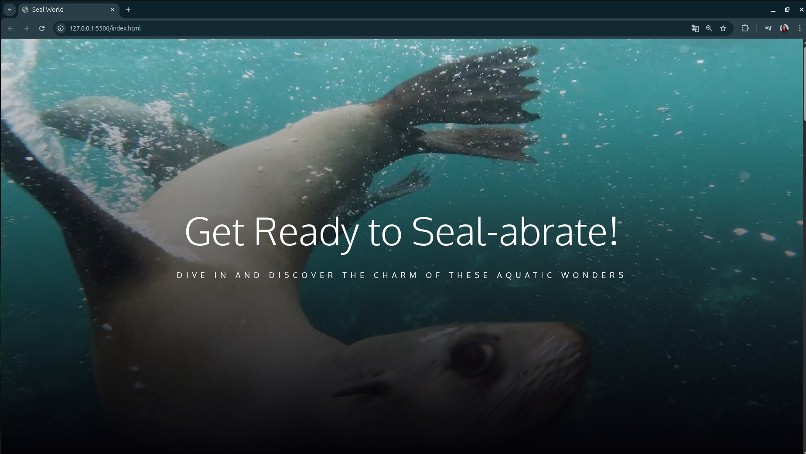
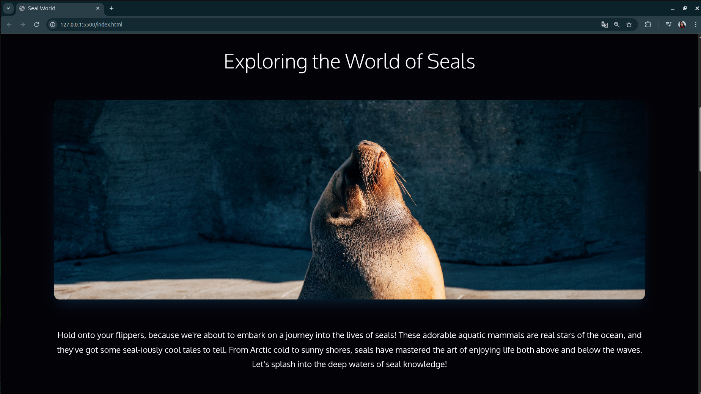
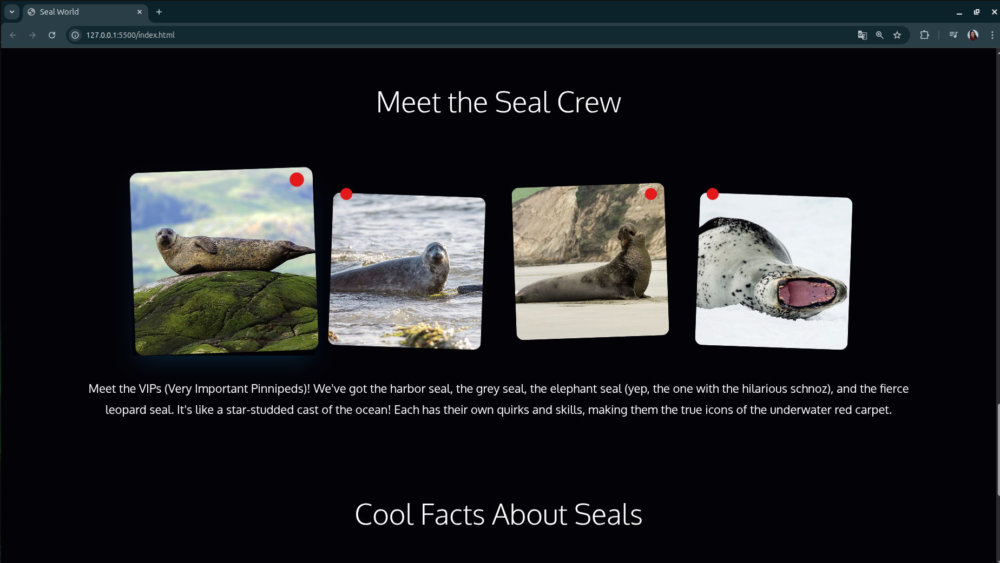

# 🦭 Seal World

Projeto desenvolvido durante o curso de Desenvolvimento Full Stack JavaScript da Onebitcode, com foco na prática e domínio de **CSS3**.

O site apresenta informações sobre o mundo das focas, utilizando conceitos fundamentais de layout, responsividade e organização visual.

## Tecnologias utilizadas

- HTML5
- CSS3
- Boas práticas de organização e semântica

## Objetivo do projeto

- Consolidar conhecimentos em CSS3
- Criar layouts responsivos
- Trabalhar hierarquia visual e espaçamentos
- Desenvolver um projeto com código limpo e organizado

## Preview

## Como executar o projeto

1. Clone o repositório:
git clone https://github.com/allanamatias/seal-world-site.git

2. Projeto online:
https://allanamatias.github.io/seal-world-site/
